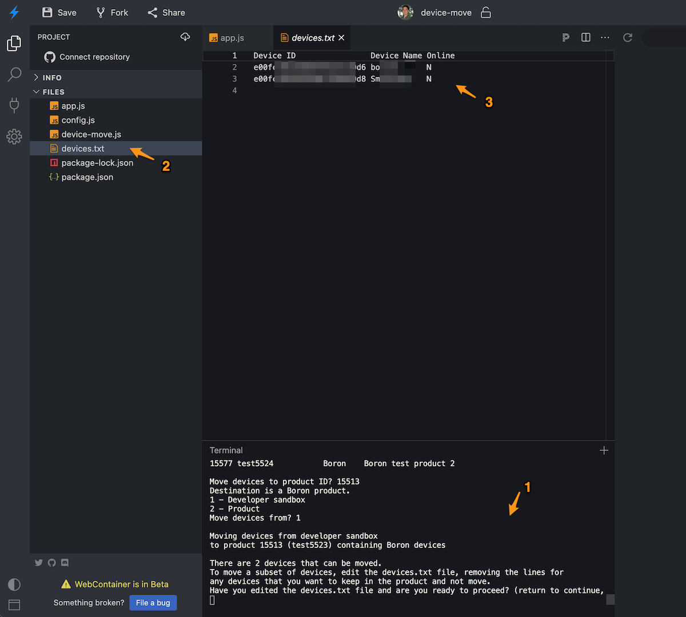

# node-example-device-move

*Example script for moving Particle devices between sandbox and products*


- Moving devices from your developer sandbox into your product is useful if you are just now creating a product and want to use it instead of developer devices.
- If you are migrating the the growth plan, whenever possible you should move your entire product into your organization on the growth plan. This is generally painless and has no interruption in service. Moving individual devices from one product to another should only be done as a last resort because there numerous caveats and it can be be disruptive.

## Warning!

- **Moving a device into a product may have billing implications**, especially when moving devices from the free developer sandbox into a growth tier product, where additional devices could require additional blocks to accommodate the added devices. 

- **Make sure destination has a default product release**

After moving the device, it will need to be flashed with the new product firmware. This is automatic if the destination product has a default firmware release.

If it does not, you will need to lock and flash, or mark as developer device and manually flash the firmware.

- **Do not use with customer claiming!**

This tool should only be used if you claim your devices to a single account, a small number of team member accounts, or leave devices unclaimed.

If you are using simple auth customers or two-legged shadow customers, you should not use this tool. The reason is that customers are defined in the product, and not only does this tool not move them, it's not possible to do so without breaking the authentication tokens for the user.

If you are using customer claiming (more common with Wi-Fi) you should avoid switching products because it can be very disruptive!

- **Beware of wildcard PRODUCT_ID**

If you are using the wildcard product ID (`PRODUCT_ID(PLATFORM_ID)`), instead of your specific product ID in your product firmware, the version comparison is only done by version number. Thus if the destination product has the same version number as the source product, it will not get flashed with the new product firmware correct. You can correct this using Lock and Flash, then unlocking.


- **Offline devices and quarantine**

If you move devices from a product into another product and they are offline, you may see them appear in quarantine in the source product. This is normal, because the device will go online with the old firmware, then the cloud will determine that they're part of a new product, then get the new product firmware. Once the device comes online with the new product firmware successfully they'll be removed from quarantine on the old product.

Do not approve the devices in quarantine in the old product, or they may be moved back to the old product!


- **Disable auto-approve new product devices in source product**

If you are not using a wildcard product ID you must disable auto-approve new product devices in the source product before moving devices if you are moving devices that are currently offline.

The reason is that when the devices come online after moving, they'll still have the old product firmware. If auto-approve is enabled, they'll then get added back into the old product, negating the effects of the move.

- **oAuth tokens**

If you are using oAuth tokens created via the Authentication tab in a user account (when moving from developer sandbox) or in a product (when moving to a different product), these tokens will no longer work when using the new product. You must create new oAuth tokens from a new client ID and secret created in the destination product. It's not possible to transfer oAuth tokens between accounts or products.


## Installation (locally)

1. If you have not already installed [node.js](https://nodejs.org/), v12 or later. The current LTS is 14.18.1, and the current LTS is the recommended version to use.

2. Download this repository from Github. 

3. From a command prompt or terminal window:

```
cd DeviceMove
npm install
node app.js
```

4. If you just run the tool, it will prompt you to log in, select your product.

5. You can also edit config.js to customize the configuration, or edit the source in app.js to really customize the behavior.

## Running in a web browser

If you do not want to install node.js, or can't, because you have a managed computer or Chromebook, you can run the tool from the Chrome web browser on Windows, Linux, Mac, and Chromebook. This uses [Stackblitz](https://stackblitz.com) to run a virtual machine and node *in your web browser*.

In the Terminal pane in the lower center of the window, enter the command:

```
node app.js
```

As long as you do not save your project, all of the data is stored in your web browser only and will disappear entirely when you close the browser tab. 

If you create a Stackblitz account you can save your project with changes and come back to it later. However, if you are using a free account, be sure to not save any sensitive information like access tokens, because projects in the free account tier are public. By default, the tool does not save access tokens. Only the code and files are saved; any temporary data in memory and the contents of the terminal window are not saved, so you don't have to worry about things you enter interactively even if you save.

Other web browsers will be supported in the future, but this currently only works with Chrome. 

## Example usage

The tool is interactive, and there are numerous warnings. Be sure to heed the warnings!

All selections require using the Return or Enter key.

```
❯ node app.js
Moving devices into a product may affect billing and typically requires that 
new firmware be flashed to the device. It may also require a Device OS update
on some devices. Devices may be offline for a period of time while moving
devices.

If you are migrating to growth you should instead move entire products into
your organization which is non-disruptive in most cases and significantly less
dangerous.
Do you want to continue? (return to continue, q to quit) 
```

You will be prompted to log into your Particle account. The password will not display, and backspace or delete do not work in the password field; you must type it in exactly, case-sensitive. If you make a mistake, just hit return and it will prompt you to try again.

```
You must log into your Particle account
Particle username (account email): user@company.com
Password: (will not display as you type) 
Logged in as user@company.com
```

You will next be prompted to select the product to move to. Note that you select the destination first! Enter the product ID (for example, 15577) and press return.

```
Select the destination product to move devices to 
ID    Name               Platform Description                                                     
15513 test5523           Boron    Boron Test Product                         
15577 test5524           Boron    Boron test product 2                       

Move devices to product ID?
```

You'll then be prompted to choose whether you want to move devices from your developer sandbox into a product, or between products.

```
1 - Developer sandbox
2 - Product
Move devices from? 
```

If you select product, you may be prompted to choose between a sandbox product and an organization product (if you have access to an organization), or you may just be prompted for a product. Since a product can only have one kind of device in it, you'll only have products of the same type of device shown in the list.

```
Move devices from? 2
ID    Name           Platform Description            
15513 test5523       Boron    Boron Test Product    
```

You will then have the option of selecting which devices to move:

```
Moving devices from product 15513 (test5523)
to product 15577 (test5524) containing Boron devices

There are 2 devices that can be moved.
To move a subset of devices, edit the devices.txt file, removing the lines for
any devices that you want to keep in the product and not move.
Have you edited the devices.txt file and are you ready to proceed? (return to continue, q to quit) 
```

All of the available devices are written to the devices.txt file in the same directory as app.js. Edit this file to review the list of devices, and if you only want to move some devices, delete the lines for the devices you want to leave, so the file only contains devices you want to move.

For example, if I left only one device in the devices.txt file, I might get something like this as the confirmation. Note that you must enter y then return to confirm this selection.

```
You have selected 1 devices to move
Device ID                Device Name     
e00f999999999999999cd238 B40H99999999JV7 

Continue with this selection (y) or check devices.txt again (n)? (y or n) y
```

You may get additional warnings and confirmations, and when confirmed, the move operation will take place.

```
Moving devices can affect billing, data usage, and devices may go offline for a period of time.

Are you sure you want to proceed with moving devices? (y or n) y
Removing e00f999999999999999cd238 from 15513 succeeded
Adding e00f999999999999999cd238 to 15577 succeeded
Move complete!
```

### Using the Web browser 

When using the web browser version of the script:

- Run the script by using `node app.js` in the Terminal window (1). Enter the options as above.

- When you get to the editing devices.txt step, click on **devices.txt** in the file browser (2) and it will open in a new tab.

- Edit the devices.txt file tab (3) by deleting all of the lines for devices you want to leave, so only the devices you want to move are in the file. Don't forget to save your edits using the **Save** icon, Command-S (Mac), or Ctrl-S (Windows or Linux).




## Code Overview

You will typically use this tool without editing the configuration or code at all; you will be prompted for login and essential things like the products and devices to move to interactively from the terminal.

- config.js - configurable parameters, but you will rarely need to edit them
- app.js - the main entry point to the program
- device-move.js - the code to do the device move process

## Version History

### 0.0.1 (2021-11-18)

- Initial version


